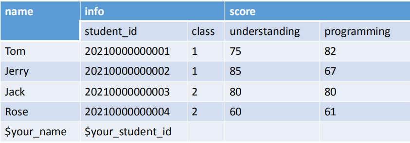
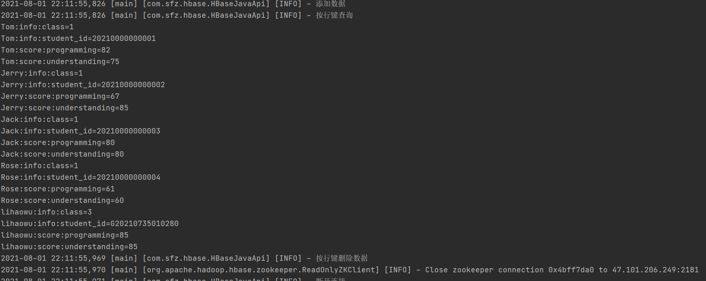
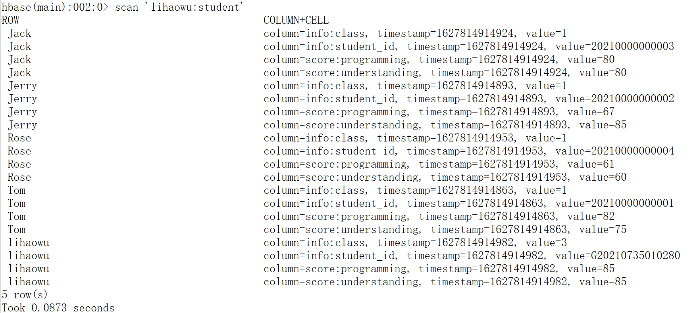

##目的
通过Java API操作HBase实现建表，插入数据，删除数据，查询等功能
表格式为

##准备
###依赖的包

        <dependency>
            <groupId>org.apache.hbase</groupId>
            <artifactId>hbase-client</artifactId>
            <version>2.1.0</version>
        </dependency>

###使用说明
Configuration:用于指定配置

Connection:用于获取hbase连接，通过ConnectionFactory创建，调用getAdmin()获取Admin以得到管理权力，调用getTable可以获取table对象

Admin:可以调用createTable、deleteTable操作表

Table:可以调用get、put、delete、scan操作表数据

###类说明
HBaseJavaApi.java为对hbase操作的运行过程。

HBaseUtil.java为对Hbase操作的工具类，包括创立连接、建表、删表、增删查数据

Student.java为添加数据的实例类。

##运行截图

