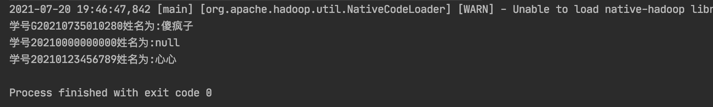
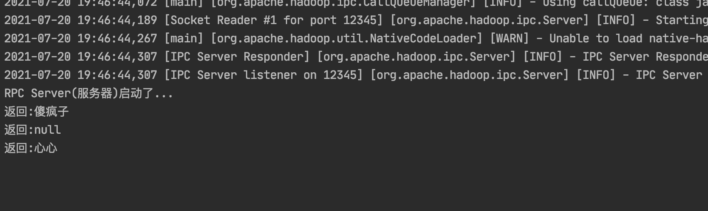

# 实现思路

1.需要自定义一个RPC协议接口，继承hadoop.ipc下的VersionedProtocaol,描述提供了哪些接口或或功能。
notes：需要申明版本号

2.实现server端协议接口，并返回版本号（getProtocolVersion）

3.构建服务器代码：
（1）创建RPC Server的构建器
（2）设置构建起相关的参数，IP、端口、RPC接口、RPC接口实现类
（3）构建RPC server
（4）启动

4.构建客户端：
（1）通过Socket连接 RPC Server
（2）获取RPC代理
（3）执行RPC接口中的方法并获取结果

##### 运行截图

#### 参考文献：
https://github.com/LantaoJin/DistributedSystemUsingJavaNIO