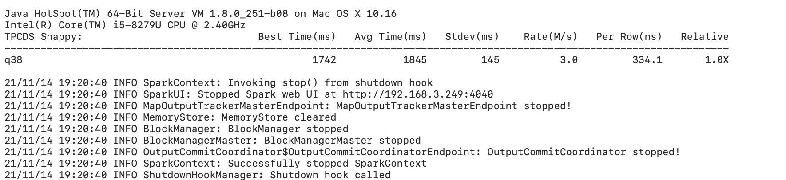

# 思路


## 目的和准备

题目一： 分析一条 TPCDS SQL（请基于 Spark 3.1.1 版本解答）
SQL 从中任意选择一条：
https://github.com/apache/spark/tree/master/sql/core/src/test/resources/tpcds

（1）运行该 SQL，如 q38，并截图该 SQL 的 SQL 执行图  
（2）该 SQL 用到了哪些优化规则（optimizer rules）   
（3）请各用不少于 200 字描述其中的两条优化规则  
帮助文档：如何运行该 SQL：

1 从 github 下载 TPCDS 数据生成器

>git clone https://github.com/maropu/spark-tpcds-datagen.git
>cd spark-tpcds-datagen

2 下载 Spark3.1.1 到 spark-tpcds-datagen 目录并解压

>wget https://archive.apache.org/dist/spark/spark-3.1.1/spark-3.1.1-bin-hadoop2.7.tgz
>tar -zxvf spark-3.1.1-bin-hadoop2.7.tgz

3 生成数据

>mkdir -p tpcds-data-1g
>export SPARK_HOME=./spark-3.1.1-bin-hadoop2.7
>./bin/dsdgen --output-location tpcds-data-1g

4 下载三个 test jar 并放到当前目录

>wget https://repo1.maven.org/maven2/org/apache/spark/spark-catalyst_2.12/3.1.1/spark-catalyst_2.1
2-3.1.1-tests.jar
>wget https://repo1.maven.org/maven2/org/apache/spark/spark-core_2.12/3.1.1/spark-core_2.12-3.1.1-
tests.jar
>wget https://repo1.maven.org/maven2/org/apache/spark/spark-sql_2.12/3.1.1/spark-sql_2.12-3.1.1-te
sts.jar

5 执行 SQL

>./spark-3.1.1-bin-hadoop2.7/bin/spark-submit --class org.apache.spark.sql.execution.benchmark.TPCDSQueryBenchmark --jars spark-core_2.12-3.1.1-tests.jar,spark-catalyst_2.12-3.1.1-tests.jar spark-sql_2.12-3.1.1-tests.jar --data-location tpcds-data-1g --query-filter "q73"


题目二：架构设计题

你是某互联网公司的大数据平台架构师，请设计一套基于 Lambda 架构的数据平台架构，要求尽可能多的把课程中涉及的组件添加到该架构图中。并描述 Lambda 架构的优缺点，要求不少于 300 字。

题目三：简答题（三选一）

A：简述 HDFS 的读写流程，要求不少于 300 字 B：简述 Spark Shuffle 的工作原理，要求不少于 300 字 C：简述 Flink SQL 的工作原理，要求不少于 300 字


##结果

###题目一

（1）运行该 SQL，如 q38，并截图该 SQL 的 SQL 执行图 

```shell script
nohup
./spark-3.1.1-bin-hadoop2.7/bin/spark-submit \
--conf spark.sql.planChangeLog.level=WARN \
--class org.apache.spark.sql.execution.benchmark.TPCDSQueryBenchmark \
--jars spark-core_2.12-3.1.1-tests.jar,spark-catalyst_2.12-3.1.1-tests.jar \
spark-sql_2.12-3.1.1-tests.jar \
--data-location tpcds-data-1g --query-filter "q38"\
> running.log 2>&1 &
```

sql执行结果图


（2）该 SQL 用到了哪些优化规则（optimizer rules） 

  
Applying Rule org.apache.spark.sql.catalyst.optimizer.ColumnPruning   列裁剪   
Applying Rule org.apache.spark.sql.catalyst.optimizer.ReplaceIntersectWithSemiJoin   
Applying Rule org.apache.spark.sql.catalyst.optimizer.ReplaceDistinctWithAggregate   
Applying Rule org.apache.spark.sql.catalyst.optimizer.ReorderJoin   连接顺序优化   
Applying Rule org.apache.spark.sql.catalyst.optimizer.PushDownPredicates   谓词下推   
Applying Rule org.apache.spark.sql.catalyst.optimizer.PushDownLeftSemiAntiJoin   
Applying Rule org.apache.spark.sql.catalyst.optimizer.CollapseProject   投影算子组合
Applying Rule org.apache.spark.sql.catalyst.optimizer.EliminateLimits   
Applying Rule org.apache.spark.sql.catalyst.optimizer.ConstantFolding   常量折叠   
Applying Rule org.apache.spark.sql.catalyst.optimizer.RemoveNoopOperators   
Applying Rule org.apache.spark.sql.catalyst.optimizer.InferFiltersFromConstraints  约束条件提取 
Applying Rule org.apache.spark.sql.catalyst.optimizer.RewritePredicateSubquery
   
共12条优化规则

（3）请各用不少于 200 字描述其中的两条优化规则  

```sql
SELECT count(*)
FROM (
       SELECT DISTINCT
         c_last_name,
         c_first_name,
         d_date
       FROM store_sales, date_dim, customer
       WHERE store_sales.ss_sold_date_sk = date_dim.d_date_sk
         AND store_sales.ss_customer_sk = customer.c_customer_sk
         AND d_month_seq BETWEEN 1200 AND 1200 + 11
       INTERSECT
       SELECT DISTINCT
         c_last_name,
         c_first_name,
         d_date
       FROM catalog_sales, date_dim, customer
       WHERE catalog_sales.cs_sold_date_sk = date_dim.d_date_sk
         AND catalog_sales.cs_bill_customer_sk = customer.c_customer_sk
         AND d_month_seq BETWEEN 1200 AND 1200 + 11
       INTERSECT
       SELECT DISTINCT
         c_last_name,
         c_first_name,
         d_date
       FROM web_sales, date_dim, customer
       WHERE web_sales.ws_sold_date_sk = date_dim.d_date_sk
         AND web_sales.ws_bill_customer_sk = customer.c_customer_sk
         AND d_month_seq BETWEEN 1200 AND 1200 + 11
     ) hot_cust
LIMIT 100
```

PushDownPredicates:将运算符和join进行谓词下推，例如对d_month_seq大于1200小于1211下推到parquet
通过检查对计划FILTER, JOIN，将条件推到数据读取的时候，能大幅度减少数据读取的数量和运算的数量。

PushedFilters: [IsNotNull(d_month_seq), GreaterThanOrEqual(d_month_seq,1200), LessThanOrEqual(d_month_seq,1211)

ConstantFolding:将某个可以稳定等于具体值的表达式进行替换,如1200 + 11= 1211,那么可以将其替换为1211。   
通过对计划的检查，如果发现含有此类表达式，就可以对其进行优化，防止每执行一条数据都进行一次计算，以提高计算效率。

优化前:Filter ((d_month_seq#332 >= 1200) AND (d_month_seq#332 <= (1200 + 11)))
优化后:Filter ((d_month_seq#332 >= 1200) AND (d_month_seq#332 <= 1211))

###题目二

你是某互联网公司的大数据平台架构师，请设计一套基于 Lambda 架构的数据平台架构，要求尽可能多的把课程中涉及的组件添加到该架构图中。并描述 Lambda 架构的优缺点，要求不少于 300 字。


优点:  
容错性和鲁棒性:具有容错能力，实时处理层出故障后数据容易恢复，并且保证数据能一致。
低延时:可以良好的应用离线和实时场景，对于低延时的场景也可以进行很好的写入和读取。
横向扩容:当数据量/负载增大时，可扩展性的系统通过增加更多的机器资源来维持性能。
通用性:此架构能适应广泛的应用。
可扩展:增加新功能新特性代价较小。
可调试性:Lambda体系架构通过每一层的输入和输出，极大地简化了计算和查询的调试


缺点:
结构复杂，要保证数据同步，并且批处理层中的任何数据都不会被丢弃，资源消耗较高。     
这两层虽然运行同一组数据，但是它们是在完全不同的系统上构建的，用户需要维护两套相互独立的系统代码，维护困难，


###题目三

简答题（三选一）
A：简述 HDFS 的读写流程，要求不少于 300 字  
B：简述 Spark Shuffle 的工作原理，要求不少于 300 字  
C：简述 Flink SQL 的工作原理，要求不少于 300 字  

A. 简述 HDFS 的读写流程，要求不少于 300 字  
读  
1.客户端通过由FileSystem的open方法获得Distributed FileSystem向NameNode请求下载指定文件，NameNode获取文件的元数据信息（主要是Block的存放位置），并且返回给客户端。  
2.客户端根据返回的Block位置信息，请求最近的的DataNode节点，获取数据。  
3.DataNode会向客户端传输数据，客户端会以Packet为单位接收，先在本地缓存，然后写入对应的文件。  

写  
1.客户端首先通过Distributed FileSystem向NameNode发送请求上传文件，NameNode会检查目标文件是否已存在，父目录是否存在等。    
2.NameNode如果检查通过，则会返回该文件的所有Block块及对应存储的DataNode列表，否则，抛异常结束。  
3.客户端收到Block块及对应存储的DataNode列表之后，就开始向对应的节点中上传数据。  
4.客户端通过FSDataOutputStream首先上传第一个Block块，上传到对应的第一个节点，然后第一个节点上传到第二个节点，第二节点再上传到第三个节点。  
5.客户端接着再上传第二个Block块，流程如上。  
6.当所有的Block块都传完以后，客户端会给NameNode返回一个状态信息，表示数据已经全部写入成功，或者失败。  
7.NameNode根据客户端返回的状态信息来判断本次写入数据是成功还是失败，如果成功，则需要对应更新元数据信息。  


