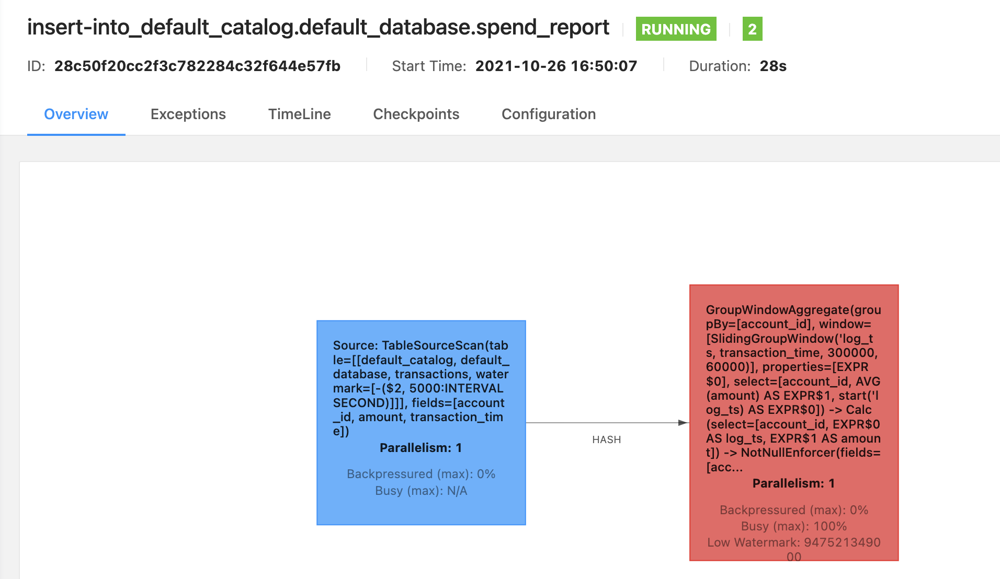
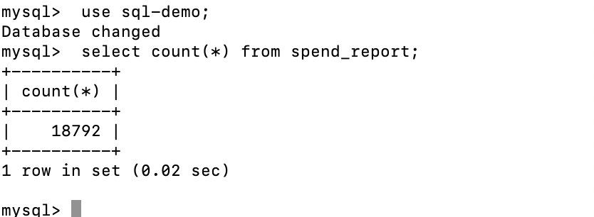
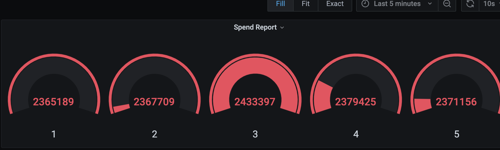

# 思路


## 目的

report(transactions).executeInsert("spend_report");
将transactions表经过report函数处理后写入到spend_report表。

每分钟（小时）计算在五分钟（小时）内每个账号的平均交易金额（滑动窗口）  
注：使用分钟还是小时作为单位均可


## 准备

### 代码环境

配置文件位于flink-playgrounds仓库中，首先检出该仓库并构建
docker镜像：
> git clone https://github.com/apache/flink-playgrounds.git  
> cd flink-playgrounds/table-walkthrough 

### 如何运行和停止

在开始运行之前先在Docker主机上创建检查点和保存点目录   
• mkdir -p /tmp/flink-checkpoints-directory   
• mkdir -p /tmp/flink-savepoints-directory   
编译打包代码   
• docker-compose build   
启动环境：   
• docker-compose up -d   
执行如下命令停止docker环境：   
• docker-compose down -v   

### 查看和验证

Flink WebUI界面   
• 打开浏览器并访问http://localhost:8081   
日志   
• 查看JobManager日志：docker-compose logs -f jobmanager   
• 查看TaskManager日志：docker-compose logs -f taskmanager   
把结果导入MySQL   
• docker-compose exec mysql mysql -Dsql-demo -usql-demo -pdemo-sql   
• mysql> use sql-demo;   
• mysql> select count(*) from spend_report;    
在Grafana查看最终结果   
• http://localhost:3000/d/FOe0PbmGk/walkthrough?viewPanel=2&orgId=1&refre
sh=5s

### 完成功能代码

• IDE中找到SpendReport.java   
• 实现方法public static Table report(Table transactions)   
• 例如直接什么都不做，把source直接写入sink： 
```
public static Table report(Table transactions) {   
return transactions;   
}
```  

### 源码介绍

```
//输入表transaction，用于读取信用卡交易数据，其中包含账户ID(account_id)，美元金额和时间戳

tEnv.executeSql("CREATE TABLE transactions (\n" +
" account_id BIGINT,\n" +
" amount BIGINT,\n" +
" transaction_time TIMESTAMP(3),\n" +
" WATERMARK FOR transaction_time AS transaction_time - INTERVAL '5' SECOND\n" +
") WITH (\n" +
" 'connector' = 'kafka',\n" +
" 'topic' = 'transactions',\n" +
" 'properties.bootstrap.servers' = 'kafka:9092',\n" +
" 'format' = 'csv'\n" +
")");

//输出表spend_report存储聚合结果，是mysql表

tEnv.executeSql("CREATE TABLE spend_report (\n" +
" account_id BIGINT,\n" +
" log_ts TIMESTAMP(3),\n" +
" amount BIGINT\n," +
" PRIMARY KEY (account_id, log_ts) NOT ENFORCED" +
") WITH (\n" +
" 'connector' = 'jdbc',\n" +
" 'url' = 'jdbc:mysql://mysql:3306/sql-demo',\n" +
" 'table-name' = 'spend_report',\n" +
" 'driver' = 'com.mysql.jdbc.Driver',\n" +
" 'username' = 'sql-demo',\n" +
" 'password' = 'demo-sql'\n" +
")");
```

## 实现

### 功能代码实现

```
public static Table report(Table transactions) {
        Table table = transactions.window(Slide.over(lit(5).minutes())
                .every(lit(1).minutes())
                .on($("transaction_time"))
                .as("log_ts"))
                .groupBy($("account_id"),$("log_ts"))
                .select($("account_id"),$("log_ts").start().as("log_ts"),$("amount").avg().as("amount"))
                ;
        return table ;
    }
```

###结果截图

flinkWebUi截图


mysql查询结果截图


Grafana查看结果截图



