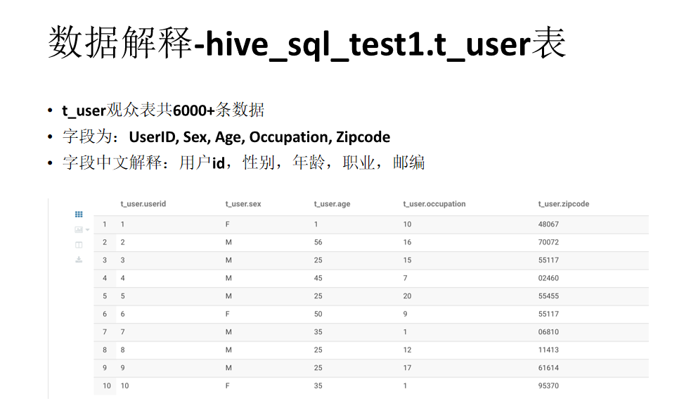
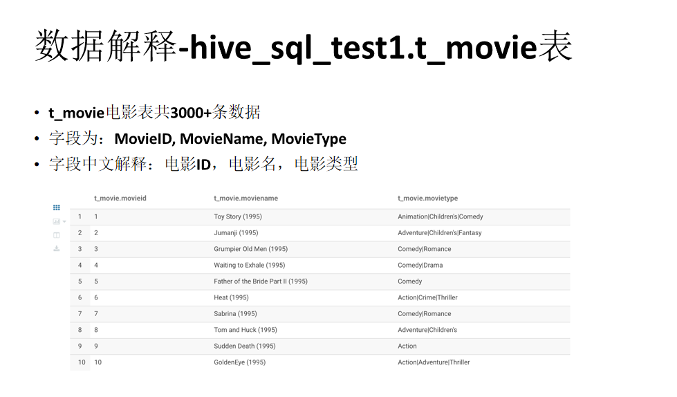
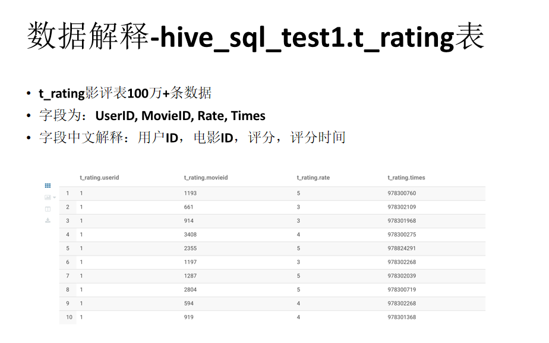
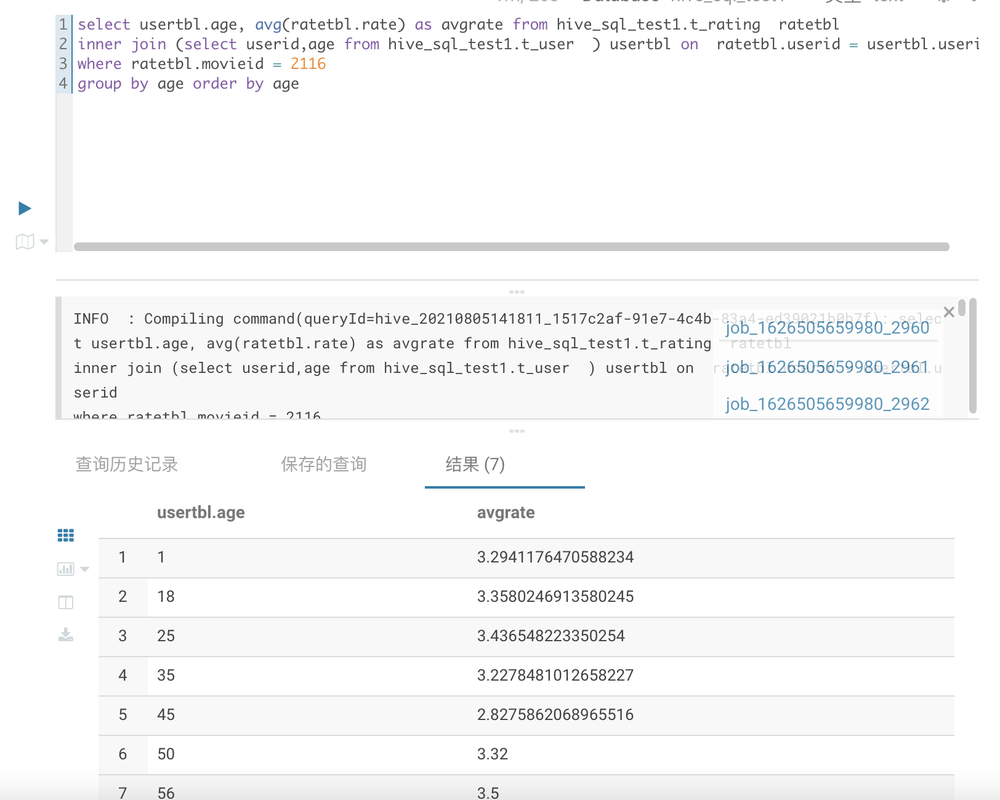
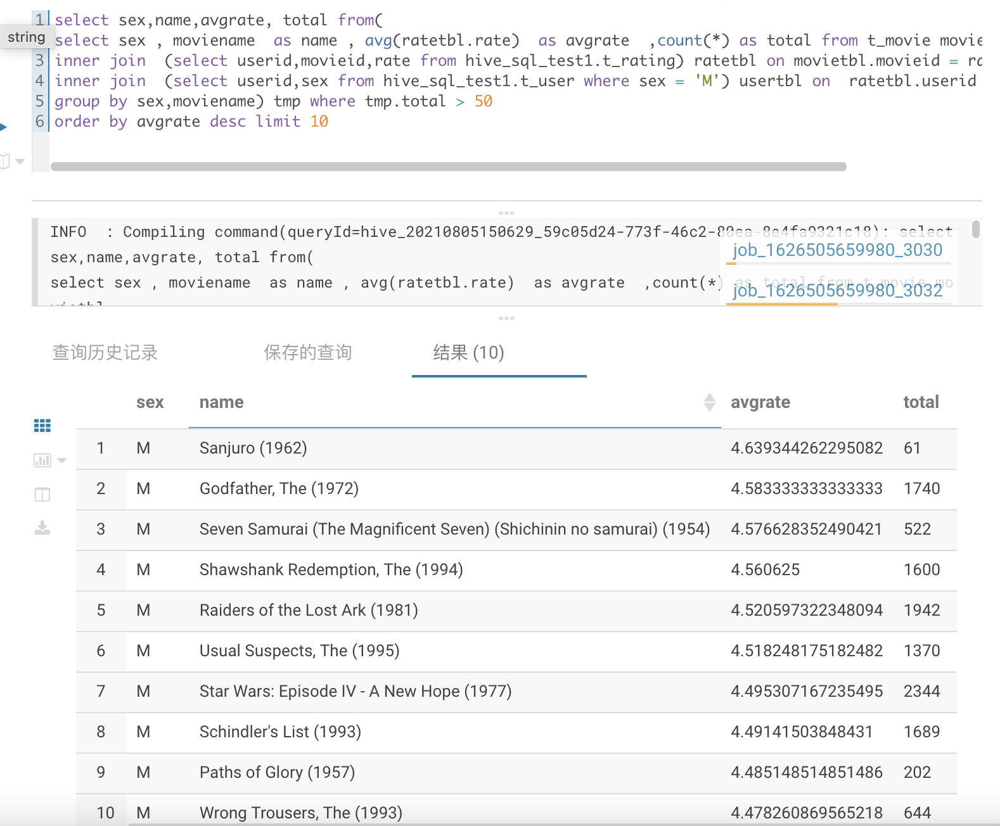
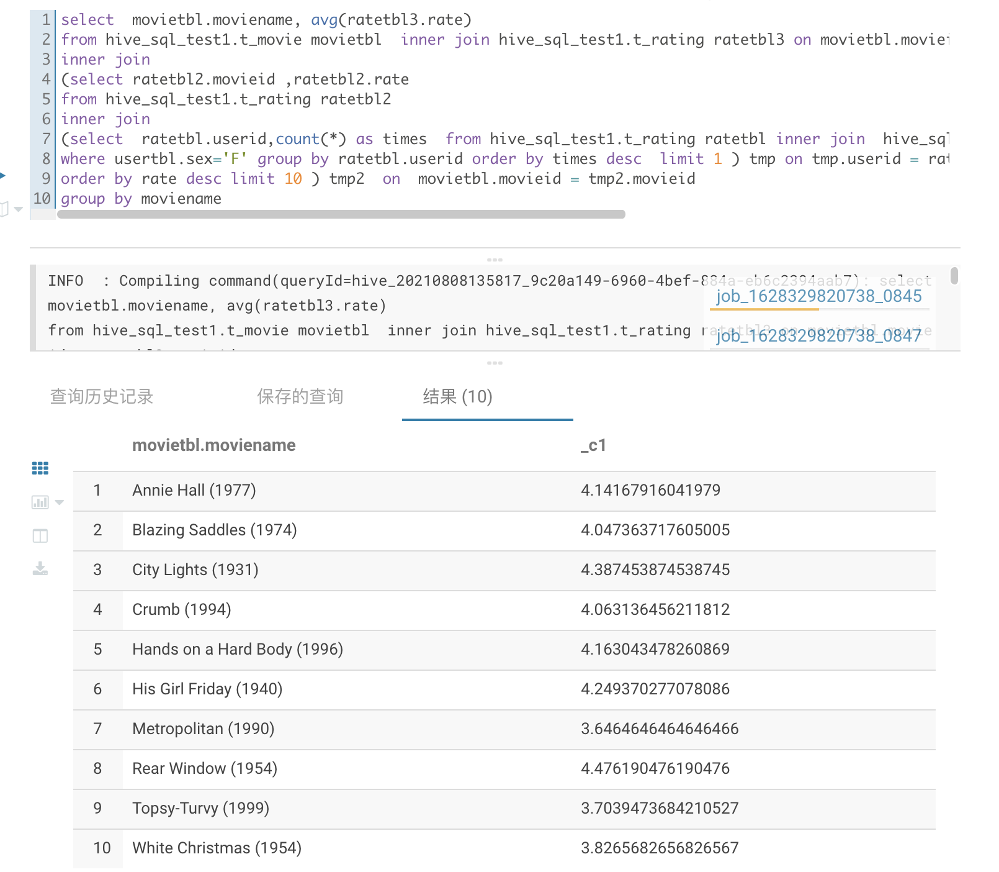

# 思路


## 目的


在HUE上跑SQL,以解决相关计算问题

## 准备








题目一： 简单：展示电影ID为2116这部电影各年龄段的平均影评分

题目二： 中等：找出男性评分最高且评分次数超过50次的10部电影，展示电影名，平均影评分和评分次数

题目三： 困难：找出影评次数最多的女士所给出最高分的10部电影的平均影评分，展示电影名和平均影评分（可使用多行SQL）

---

## SQL
题目一思路：

1. 在t_rating表中查出ID为2116电影的的影评。

2. 将影评中的用户与t_user表的用户相关联以得出其年龄

3. 再对分数进行分年龄求平均

题目二思路：

1. 通过将t_rating与t_user联表查询获得所有男性的评分

2. 将t_movie表与上一步结果进行联表，并筛选评分次数超过50次电影，并获得其其电影名、平均影评分和评分次数

3. 把电影按平均应评分排序，并只取分数最高的10部电影

题目三思路：

1.  通过将t_rating与t_user联表查询获得影评次数最多的女性

2.  将t_rating与上一步结果联表查询获得这位女性所给评分最高的10部电影

3.  将t_movie与t_rating联表获得电影名和平均影评分，并通过与上一步联表选取那10部电影的结果。

```
--题目一：展示电影ID为2116这部电影各年龄段的平均影评分
select usertbl.age, avg(ratetbl.rate) as avgrate from hive_sql_test1.t_rating  ratetbl
inner join (select userid,age from hive_sql_test1.t_user  ) usertbl on  ratetbl.userid = usertbl.userid
where t_rating.movieid = 2116
group by age order by age

--题目二：找出男性评分最高且评分次数超过50次的10部电影，展示电影名，平均影评分和评分次数
select sex,name,avgrate, total from(
select sex , moviename  as name , avg(ratetbl.rate)  as avgrate  ,count(*) as total from t_movie movietbl
inner join  (select userid,movieid,rate from hive_sql_test1.t_rating) ratetbl on movietbl.movieid = ratetbl.movieid
inner join  (select userid,sex from hive_sql_test1.t_user where sex = 'M') usertbl on  ratetbl.userid = usertbl.userid
group by sex,moviename) tmp where tmp.total > 50
order by avgrate desc limit 10

--题目三： 找出影评次数最多的女士所给出最高分的10部电影的平均影评分，展示电影名和平均影评分
select  movietbl.moviename, avg(ratetbl3.rate)
from hive_sql_test1.t_movie movietbl  inner join hive_sql_test1.t_rating ratetbl3 on movietbl.movieid = ratetbl3.movieid
inner join
(select ratetbl2.movieid ,ratetbl2.rate
from hive_sql_test1.t_rating ratetbl2
inner join
(select  ratetbl.userid,count(*) as times  from hive_sql_test1.t_rating ratetbl inner join  hive_sql_test1.t_user usertbl on  ratetbl.userid=usertbl.userid
where usertbl.sex='F' group by ratetbl.userid order by times desc  limit 1 ) tmp on tmp.userid = ratetbl2.userid
order by rate desc limit 10 ) tmp2  on  movietbl.movieid = tmp2.movieid
group by moviename
```

---

## 运行截图







---

##### 参考资料

基本SQL教程：

https://www.w3school.com.cn/sql/index.asp

https://www.liaoxuefeng.com/wiki/1177760294764384

Hive DDL：

https://cwiki.apache.org/confluence/display/Hive/LanguageManual+DDL


#### 附加作业：GeekFileFormat

要求：

实现两个类：GeekTextInputFormat和GeekTextOutputFormat

建表时使用create table ... stored as geek来创建GeekFormat表

该表的文件类型为文本类型，非二进制类型

类似Base64TextInputFormat和Base64TextOutputFormat，GeekFormat也是用于加密

解密规则如下：文件中出现任何的geek，geeeek，geeeeeeeeeeek等单词时，进行过滤，即删除该单词。gek需要保留。字母中连续的“e”最大长度为256个。

例如：    This notebook can be geeeek used to geek install gek on all geeeek worker nodes, run data generation, and create the TPCDS geeeeeeeeek database.

解密为：This notebook can be used to install gek on all worker nodes, run data generation, and create the TPCDS database.


【附加的附加】加密规则如下：文件输出时每随机2到256个单词，就插入一个gee...k，字母e的个数等于前面出现的非gee...k单词的个数。

例如：    This notebook can be used to install gek on all worker nodes, run data generation, and create the TPCDS database.

加密为：This notebook can be geeeek used to geek install gek on all geeeek worker nodes, run data generation, and create the TPCDS geeeeeeeeek database.

参考:

https://cwiki.apache.org/confluence/display/Hive/DeveloperGuide#DeveloperGuide-RegistrationofNativeSerDes