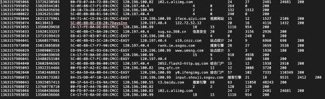
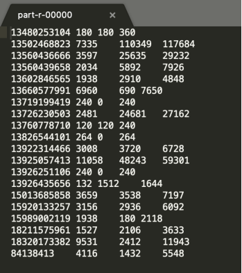
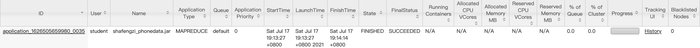

# 思路

## 目的

统计每一个手机号码耗费得总上行流量、下行流量、总流量

## 准备

(1)输入数据格式：
时间戳、电话号码、基站的物理地址、访问网址的ip、网站域名、数据包、接包数、上行/传流量、下行/载流量、响应码

(2)最终输出的数据格式：

手机号码 上行流量 下行流量 总流量

3.基本思路：

(1)Map阶段：

(a)读取一行数据，切分字段

(b)抽取手机号、上行流量、下行流量

(c)以手机号为key，bean对象为value输出，即context.write(手机号,bean);

(2)Reduce阶段：

(a)累加上行流量和下行流量得到总流量。

(b)实现自定义的bean来封装流量信息，并将bean作为map输出的key来传输

(c)MR程序在处理数据的过程中会对数据排序(map输出的kv对传输到reduce之前，会排序)，排序的依据是map输出的key
所以，我们如果要实现自己需要的排序规则，则可以考虑将排序因素放到key中，让key实现接口：WritableComparable。 然后重写key的compareTo方法。

## 运行截图

