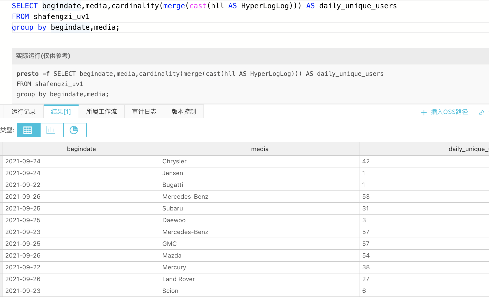

# 思路


## 目的

HyperLogLog算法在Presto的应用  
1. 搜索HyperLogLog算法相关内容，了解其原理，写出5条HyperLogLog的用途或大数据场景下的实际案例。  
2. 在本地docker环境或阿里云e-mapreduce环境进行SQL查询，要求在Presto中使用HyperLogLog计算近似基数。（请自行创
建表并插入若干数据） 
3. 学习使用Presto-Jdbc库连接docker或e-mapreduce环境，重复上述查询。（选做） 


## 题目一


### HyperLogLog的用途或大数据场景下的实际案例

用户大量数据情况下去重统计:

统计注册 IP 数  
统计每日访问 IP 数  
统计页面实时 UV 数  
统计在线用户数  
统计每天搜索不同词条的个数  
统计真实文章阅读数  

## 题目二

### 准备

创建相关表

```sql
create table shafengzi_uv1 (
  begindate integer,
  media varchar,
  hll varbinary
)
```
```sql
create external table shafengzi_base(
pdate date,
media string,
userid int 
)
row format delimited fields terminated by ','
```

```sql
INSERT INTO  shafengzi_uv1 
SELECT pdate, media, cast(approx_set(userid) AS varbinary)
FROM shafengzi_base
GROUP BY pdate, media;
```

```sql
SELECT begindate,media,cardinality(merge(cast(hll AS HyperLogLog))) AS daily_unique_users
FROM shafengzi_uv1
group by begindate,media;

```

### 运行结果截图



## 题目三

### 准备

[PrestoJdbcTest](src/main/java/com/sfz/presto/PrestoJdbcTest.java)

### 运行结果截图

