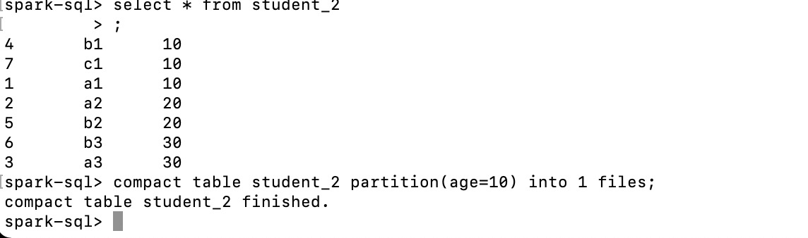

# 思路


## 目的

1.思考题：如何避免小文件问题   
如何避免小文件问题？给出2～3种解决方案

2.实现Compact table command  
• 要求：  
添加compact table命令，用于合并小文件，例如表test1总共有50000个文件，
每个1MB，通过该命令，合成为500个文件，每个约100MB。 
• 语法：  
COMPACT TABLE table_identify [partitionSpec] [INTO fileNum FILES];
• 说明：  
1.如果添加partitionSpec，则只合并指定的partition目录的文件。  
2.如果不加into fileNum files，则把表中的文件合并成128MB大小。  
3.以上两个算附加要求，基本要求只需要完成以下功能：  
COMPACT TABLE test1 INTO 500 FILES;  
代码参考  
SqlBase.g4:  
| COMPACT TABLE target=tableIdentifier partitionSpec?
(INTO fileNum=INTEGER_VALUE identifier)? #compactTable

3.Insert命令自动合并小文件
  
我们讲过AQE可以自动调整reducer的个数，但是正常跑Insert命
令不会自动合并小文件，例如insert into t1 select * from t2;

请加一条物理规则（Strategy），让Insert命令自动进行小文件合
并(repartition)。（不用考虑bucket表，不用考虑Hive表）

代码参考

```

object RepartitionForInsertion extends Rule[SparkPlan] {
override def apply(plan: SparkPlan): SparkPlan = {
plan transformDown {
case i @ InsertIntoDataSourceExec(child, _, _, partitionColumns, _)
...
val newChild = ...
i.withNewChildren(newChild :: Nil)
} } }

```

## 题目一

### 答案

参考彦功老师PPT答案：
1.对于原始数据进行按照分区字段进行shuffle（distribute by xyz）

1)对于原始数据进行按照分区字段进行shuffle，可以规避小文件问题。但有可能引入数据倾斜的问题；  
2)可以通过distribute by ss_sold_date_sk, cast(rand() * N as int)，N值可以在文件数量和倾斜度之间做权衡  
3)知道倾斜键的情况下，可以将原始数据分成几个部分处理，不倾斜的按照分区键shuffle，倾斜部分可以按照rand函数来shuffle  
4)活用Spark SQL自适应功能，目前Spark 的各版本的Release中其实也就两个参数，设spark.sql.adaptive.enabled=true即可开启该功能，spark.sql.adaptive.shuffle.targetPostShuffleInputSize设置reduce任务处理文件的上限，配合结论3使用，解决小文件问题事半功倍。  
参考链接：https://www.jianshu.com/p/ddd2382a738a

2.通过repartition算子控制最后的DataSet的分区数

3.开启自适应查询执行（AQE）
spark.sql.adaptive.enabled=true

4.定期合并历史数据

参考:https://cloud.tencent.com/developer/article/1805731

## 题目二

### 准备

准备spark源码  
下载地址http://spark.apache.org/downloads.html

修改后的代码放在https://github.com/sillyMadman/spark

### 实现

复现彦功老师的代码功能实现

(1)修改SqlBase.g4,路径为sql/catalyst/src/main/antlr4/org/apache/spark/sql/catalyst/parser/SqlBase.g4

Spark SQL使用Antlr 4来解析SQL表达式，SqlBase.g4为其解析描述文件


在statement中加入 

```
| COMPACT TABLE target=tableIdentifier partitionSpec?
   (INTO fileNum=INTEGER_VALUE identifier)? #compactTable
```

添加完后用 Spark Project Catalyst 下在antlr4插件来生成对应的代码

(2)在SparkSqlParser.scala下实现visitCompactTable方法,CompactTableCommand(),路径为sql/core/src/main/scala/org/apache/spark/sql/execution/SparkSqlParser.scala
```
override def visitCompactTable(ctx: CompactTableContext): LogicalPlan = withOrigin(ctx) {
    val table = visitTableIdentifier(ctx.tableIdentifier())
    val filesNum = if (ctx.INTEGER_VALUE() != null) {
      Some(ctx.INTEGER_VALUE().getText)
    } else {
      None
    }
    val partitionSpec = if (ctx.partitionSpec() != null) {
      Some(ctx.partitionSpec().getText)
    } else {
      None
    }
    CompactTableCommand(table, filesNum, partitionSpec)

  }
```

(3)CompactTableCommand.scala，路径为sql/core/src/main/scala/org/apache/spark/sql/execution/command/CompactTableCommand.scala
```
/*
 * Licensed to the Apache Software Foundation (ASF) under one or more
 * contributor license agreements.  See the NOTICE file distributed with
 * this work for additional information regarding copyright ownership.
 * The ASF licenses this file to You under the Apache License, Version 2.0
 * (the "License"); you may not use this file except in compliance with
 * the License.  You may obtain a copy of the License at
 *
 *    http://www.apache.org/licenses/LICENSE-2.0
 *
 * Unless required by applicable law or agreed to in writing, software
 * distributed under the License is distributed on an "AS IS" BASIS,
 * WITHOUT WARRANTIES OR CONDITIONS OF ANY KIND, either express or implied.
 * See the License for the specific language governing permissions and
 * limitations under the License.
 */
package org.apache.spark.sql.execution.command

import org.apache.spark.sql.{Row, SaveMode, SparkSession}
import org.apache.spark.sql.catalyst.TableIdentifier
import org.apache.spark.sql.catalyst.expressions.{Attribute, AttributeReference}
import org.apache.spark.sql.types.StringType


case class CompactTableCommand(table: TableIdentifier,
                               filesNum: Option[String],
                               partitionSpec: Option[String])
  extends LeafRunnableCommand {

  private val defaultSize = 128 * 1024 * 1024

  override def output: Seq[Attribute] = Seq(
    AttributeReference("COMPACT_TABLE", StringType, nullable = false )()
  )


  override def run(sparkSession: SparkSession): Seq[Row] = {
    sparkSession.catalog.setCurrentDatabase(table.database.getOrElse("default"))

    val tempTableName = "`" + table.identifier + "_" + System.currentTimeMillis() + "`"

    val originDataFrame = sparkSession.table(table.identifier)
    val partitions = filesNum match {
      case Some(files) => files.toInt
      case None => (sparkSession.sessionState
        .executePlan(originDataFrame.queryExecution.logical)
        .optimizedPlan.stats.sizeInBytes / defaultSize).toInt + 1
    }

    if (partitionSpec.nonEmpty) {
      sparkSession.conf.set("spark.sql.sources.partitionOverwriteMode", "dynamic")

      val conditionExpr = partitionSpec.get.trim.stripPrefix("partition(").dropRight(1)
        .replace(",", "AND")

      originDataFrame.filter(conditionExpr).repartition(partitions)
        .write
        .mode(SaveMode.Overwrite)
        .saveAsTable(tempTableName)

      sparkSession.table(tempTableName)
        .write
        .mode(SaveMode.Overwrite)
        .saveAsTable(table.identifier)
    } else {
      originDataFrame.repartition(partitions)
        .write
        .mode(SaveMode.Overwrite)
        .saveAsTable(tempTableName)

      sparkSession.table(tempTableName)
        .write
        .mode(SaveMode.Overwrite)
        .saveAsTable(table.identifier)
    }

    Seq(Row(s"compact table ${table.identifier} finished."))


  }
}

```
(4)通过build/sbt clean package -Phive -Phive-thriftserver将代码编译

(5)打开spark-sql界面，bin/spark-sql -S

set hive.exec.dynamic.partition=true;
set hive.exec.dynamic.partition.mode=nonstrick;

```sql
CREATE TABLE student_2 (id INT, name STRING) PARTITIONED BY (age INT);
insert into student_2(id, name ,age) values(1, "a1", 10);
insert into student_2(id, name ,age) values(2, "a2", 20);
insert into student_2(id, name ,age) values(3, "a3", 30);
insert into student_2(id, name ,age) values(4, "b1", 10);
insert into student_2(id, name ,age) values(5, "b2", 20);
insert into student_2(id, name ,age) values(6, "b3", 30);
insert into student_2(id, name ,age) values(7, "c1", 10);
insert into student_2(id, name ,age) values(8, "c2", 20);
compact table student_2 partition(age=10) into 1 files; 
```

### 运行结果截图



