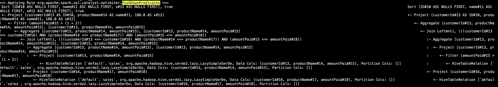
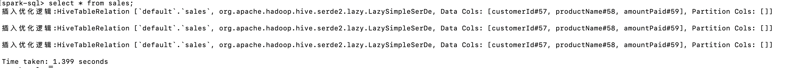

# 思路


## 目的

1 为Spark SQL添加一条自定义命令

• SHOW VERSION;

• 显示当前Spark版本和Java版本

2  构建SQL满足如下要求

通过set spark.sql.planChangeLog.level=WARN;查看
1. 构建一条SQL，同时apply下面三条优化规则：
CombineFilters
CollapseProject
BooleanSimplification
2. 构建一条SQL，同时apply下面五条优化规则：
ConstantFolding
PushDownPredicates
ReplaceDistinctWithAggregate
ReplaceExceptWithAntiJoin
FoldablePropagation

3 实现自定义优化规则（静默规则）

第一步 实现自定义规则（静默规则，通过set spark.sql.planChangeLog.level=WARN;确认执行到就行）

```$scala
case class MyPushDown(spark: SparkSession) extends Rule[LogicalPlan] { 
  def apply(plan: LogicalPlan): LogicalPlan = plan transform { …. }
}
```
第二步 创建自己的Extension并注入
```$scala
class MySparkSessionExtension extends (SparkSessionExtensions => Unit) {
  override def apply(extensions: SparkSessionExtensions): Unit = {
    extensions.injectOptimizerRule { session =>
      new MyPushDown(session)
    }
  } 
}
````
第三步 通过spark.sql.extensions提交

bin/spark-sql --jars my.jar --conf spark.sql.extensions=com.jikeshijian.MySparkSessionExtension


## 题目一

### 准备

准备spark源码  
下载地址http://spark.apache.org/downloads.html

修改后的代码放在https://github.com/sillyMadman/spark

### 实现

增加show version相关代码。

(1)修改SqlBase.g4,路径为sql/catalyst/src/main/antlr4/org/apache/spark/sql/catalyst/parser/SqlBase.g4

Spark SQL使用Antlr 4来解析SQL表达式，SqlBase.g4为其解析描述文件

在文件中SPARK-KEYWORD-LIST的位置添加:  VERSION: 'VERSION'; 
（前面为关键字，引号内为其别名）

在ANSI-NON-RESERVED和DEFAULT-NON-RESERVED分别加入VERSION

在statement中加入 

```| SHOW VERSION                                                     #showVersion```

添加完后用 Spark Project Catalyst 下在antlr4插件来生成对应的代码

(2)在SparkSqlParser.scala下实现visitShowVersion方法,并调用ShowVersionCommand(),路径为sql/core/src/main/scala/org/apache/spark/sql/execution/SparkSqlParser.scala

(3)实现ShowVersionCommand.scala，路径为sql/core/src/main/scala/org/apache/spark/sql/execution/command/ShowVersionCommand.scala

(4)通过build/sbt clean package -Phive -Phive-thriftserver将代码编译

(5)打开spark-sql界面，bin/spark-sql -S

### 运行结果截图


## 题目二


### 准备

准备spark-sql运行环境

启动bin/spark-sql,并输入set spark.sql.planChangeLog.level=WARN;

### 实现

创建表
```sql
create table sales(customerId string, productName string, amountPaid int);
```

调用以下优化规则
 CombineFilters  CollapseProject BooleanSimplification

```sql
select tmp.customerId
from  
(select customerId ,productName, amountPaid  from sales  where 1=1 and  amountPaid >= 1 and amountPaid > 3   )  tmp
where tmp.amountPaid < 2;
```

调用以下优化规则
ConstantFolding PushDownPredicates ReplaceDistinctWithAggregate ReplaceExceptWithAntiJoin FoldablePropagation

```sql
 select   tmp.customerId   ID, tmp.productName name, 188.0 x
from 
(select  distinct customerId ,productName, amountPaid  from sales except  select  customerId ,productName, amountPaid  from sales) tmp 
 where tmp.amountPaid>1+2  order by ID,name, x  ;
```

### 运行结果截图

第一个sql调用以下优化规则

CombineFilters  
CombineFilters规则未调用到，疑似被PushDownPredicates替代 
 

 
CollapseProject  


 
BooleanSimplification


第二个sql调用以下优化规则

ConstantFolding 


PushDownPredicates 



ReplaceDistinctWithAggregate 


ReplaceExceptWithAntiJoin 


FoldablePropagation


## 题目三

### 实现

实现MyPushDown类

```scala
package com.sfz.optimize

import org.apache.spark.sql.SparkSession
import org.apache.spark.sql.catalyst.plans.logical.LogicalPlan
import org.apache.spark.sql.catalyst.rules.Rule

case class MyPushDown(spark: SparkSession) extends Rule[LogicalPlan] {

    def apply(plan: LogicalPlan): LogicalPlan = plan.transform {
      case a: LogicalPlan => println("插入优化逻辑:"+a)
        a
    }

}

```


实现MySparkSessionExtension类

```scala
package com.sfz.optimize

import org.apache.spark.sql.SparkSessionExtensions

class MySparkSessionExtension extends (SparkSessionExtensions => Unit) {
  override def apply(extensions: SparkSessionExtensions): Unit = {
    extensions.injectOptimizerRule { session =>
       MyPushDown(session)
    }
  }
}

```

通过spark.sql.extensions提交  spark-sql --jars spark-sql-1.0-SNAPSHOT-jar-with-dependencies.jar --conf spark.sql.extensions=com.sfz.optimize.MySparkSessionExtension

### 运行结果截图

