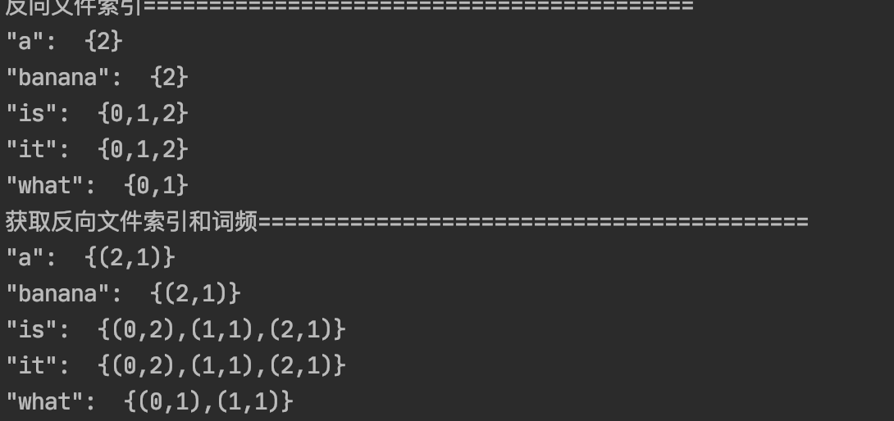

# 思路

## 目的

使用RDD API实现带词频的倒排索引

Distcp的spark实现

## 题目一

### 准备

0. "it is what it is"
1. "what is it"
2. "it is a banana"

我们就能得到下面的反向文件索引：   

"a": {2}

"banana": {2}

"is": {0, 1, 2}

"it": {0, 1, 2}

"what": {0, 1}

再加上词频为：

"a": {(2,1)}

"banana": {(2,1)}

"is": {(0,2), (1,1), (2,1)}

"it": {(0,2), (1,1), (2,1)}

"what": {(0,1), (1,1)}

### 实现

com/sfz/spark/InvertedIndexScala.scala

##### 反向文件索引

1.获取三个文件数据

2.将数据单词以空格切开，形如a banana转换为{a,banana}

3.将{a,banana}转换为Tuple二元组,如果文件数据来源于0，则转换为{a,0}

4.通过groupByKey()将数据按单词分类排序形成反向文件索引

##### 反向文件索引带词频

1.获取三个文件数据

2.将数据单词以空格切开，形如a banana转换为{a,banana}

3.将{a,banana}转换为Tuple二元组,如果文件数据来源于0，则转换为(a,0)

4.将数据转换为形如 {((a,0),1),((banana,2),1)} ,然后对前面部分进行分组聚合

5.再将数据转换为{(a,(0,1)),(banana,(2,1))}，以进行根据单词进行分组和排序最后进行排序形成结果

### 运行结果截图

## 题目二

使用Spark实现Hadoop 分布式数据传输工具 DistCp (distributed copy)，只要求实现最基础的copy功
能，对于-update、-diff、-p不做要求
对于HadoopDistCp的功能与实现，可以参考
https://hadoop.apache.org/docs/current/hadoop-distcp/DistCp.html
https://github.com/apache/hadoop/tree/release-2.7.1/hadoop-tools/hadoop-distcp
Hadoop使用MapReduce框架来实现分布式copy，在Spark中应使用RDD来实现分布式copy
应实现的功能为：
sparkDistCp hdfs://xxx/source hdfs://xxx/target
得到的结果为，启动多个task/executor，将hdfs://xxx/source目录复制到hdfs://xxx/target，得到
hdfs://xxx/target/source
需要支持source下存在多级子目录
需支持-i Ignore failures 参数
需支持-m max concurrence参数，控制同时copy的最大并发task数

### 准备

DOING